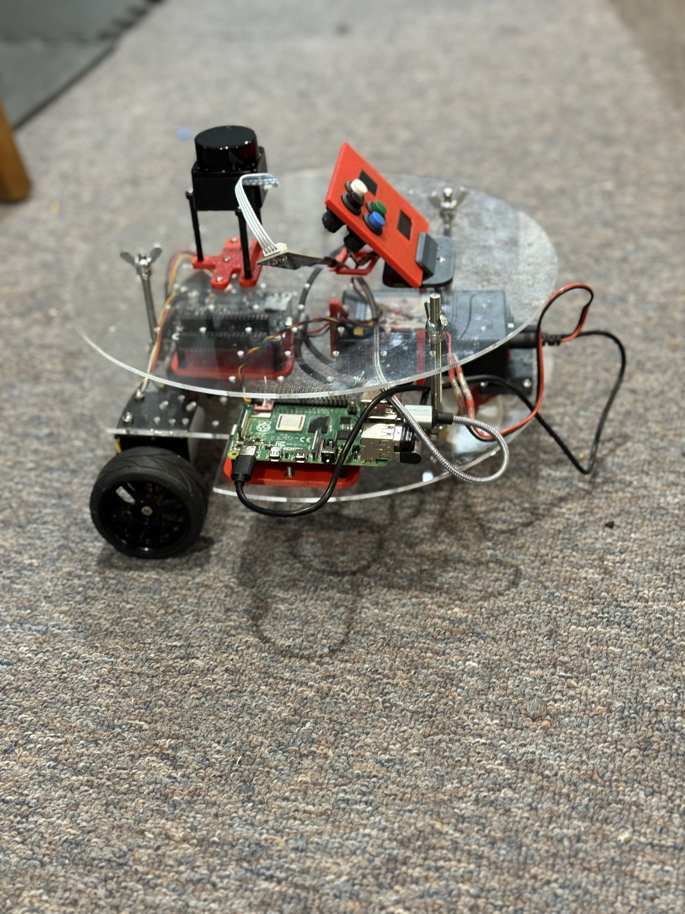

# Dome

## What is Dome

* its a [differential drive robot](https://en.wikipedia.org/wiki/Differential_wheeled_robot)
* used for learning and experimentation
* not meant as a product
* Called Dome because originally i had planned on putting a dome on top

## Linorobot2

* heavily based on the linorobot2 package by
* Based on the Linorobot2 fork supporting ESP32 f that package by 
* Their documentation is excellent and reliable

## Hardware

* WaveShare Board for Robots
* Rasberry Pi 4B

## CAD

* Key design idea is holes on a 2.5 mm grid
* And 3d Printed "adapters" to mount components on it
* [Here is an export](https://a360.co/43rDB5e) of the models being used now
* Ordered the two plates from [SendCutSend](https://cart.sendcutsend.com/jhonyptiw97d)

## Bill Of Materials - BOM

### Major Components

| Qty | Component | Brand | Link | Comments |
|-----|-----------|-------|------|----------|
| 1 | Raspberry Pi 4B+ | Raspberry Pi | [Product Page](https://www.raspberrypi.com/products/raspberry-pi-4-model-b/) | 2GB (I think) |
| 1 | Waveshare General Driver For Robots | Waveshare | [Product Page](https://www.waveshare.com/general-driver-for-robots.htm) | Includes [ESP32](https://www.espressif.com/en/products/socs/esp32), [IMU](https://en.wikipedia.org/wiki/Inertial_measurement_unit) and Motor Controllers |
| 1 | Lidar LD19 | Waveshare | [Wiki](https://www.waveshare.com/wiki/DTOF_LIDAR_LD19) | |
| 2 | 25mm geared motors with encoders | Pololu | [Product Category](https://www.pololu.com/category/115/25d-metal-gearmotors) | From my parts box |
| 1 | 12V 3000mAh Lithium ion Battery | Talentcell | [Amazon](https://www.amazon.com/dp/B01M7Z9Z1N?ref_=ppx_hzod_image_dt_b_fed_asin_title_1_1) | |

### Minor Components

| Qty | Component | Brand | Link | Comments |
|-----|-----------|-------|------|----------|
| 1 | [I2C](https://en.wikipedia.org/wiki/I%C2%B2C) "Shim" for Raspberry Pi | SparkFun | | |
| 1 | Sparkfun Micro OLED | SparkFun | [Product Page](https://www.sparkfun.com/sparkfun-micro-oled-breakout-qwiic-lcd-22495.html) | |
| 1 | SparkFun [Qwiic](https://www.sparkfun.com/qwiic) OLED Display (0.91 in., 128x32) | SparkFun | [Product Page](https://www.sparkfun.com/sparkfun-qwiic-oled-display-0-91-in-128x32.html) | |

### Software

| Component | Link | Comments |
|-----------|------|----------|
| ROS2 | [Documentation](https://docs.ros.org/en/jazzy/index.html) | |
| Linorobot2 (ESP32 fork) | [GitHub](https://github.com/hippo5329/linorobot2) | |
| My own code | [GitHub](https://github.com/pitosalas) | |

### Mechanical

| Qty | Component | Link | Comments |
|-----|-----------|------|----------|
| 2 | Circular acrylic plates with 25mm grid of holes | [SendCutSend](https://cart.sendcutsend.com/jhonyptiw97d) | |
| - | Variety of 3D printed parts | | Home made. 3D models available |
| 2 | Brackets for motors | [Amazon](https://www.amazon.com/dp/B0CRQBJV4T?ref_=ppx_hzsearch_conn_dt_b_fed_asin_title_1&th=1) | |

## Software

* Within this package there is relatively little new python
* Most of it has been setting parameters and creating new launch files
* Much of the code is indepedent and in it's own github repos

## Questions

* The motors are probably too big
* I think the batteries are running out too fast
* Need bigger battery?
* When driving on cement it rattles a lot. Why is that?
* Need softer tires
* Need "suspension"

## Next Gen: Hex

* Idea is to make the next version a hex shape
* Not sure about how many plates
* Because it will allow us to have flat 
* Would be nice if there was a "mast" to hold a camera
* Hext shapes allows 3d-printed panels to create a body
* Mission is more or less the same, this is purely the next gen of Dome

